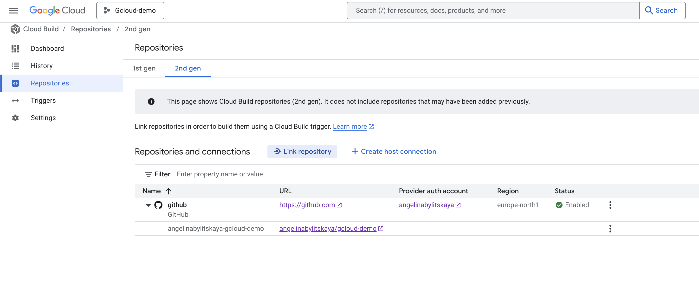

Configure Google CLoud Build for CI/CD

[script](../scripts/cicd.sh)

- [1. Create Service account](#1-create-service-account)
  - [1.1. VM](#11-vm)
  - [1.1. Cloud Run](#11-cloud-run)
  - [1.1. Cloud Run Functions](#11-cloud-run-functions)
- [2. Connect GitHub Repository](#2-connect-github-repository)
- [3. Configure Triggers](#3-configure-triggers)
  - [CD on VM:](#cd-on-vm)
  - [CD on Cloud Run](#cd-on-cloud-run)
  - [CD on Cloud Run Functions](#cd-on-cloud-run-functions)
  - [CI](#ci)
- [4. Create Artifacts Registry Repository](#4-create-artifacts-registry-repository)

## 1. Create Service account

### 1.1. VM
- roles/artifactregistry.writer
- roles/artifactregistry.reader
- roles/compute.instanceAdmin.v1

### 1.1. Cloud Run
- roles/artifactregistry.writer
- roles/artifactregistry.reader

### 1.1. Cloud Run Functions
- roles/cloudfunctions.developer

## 2. Connect GitHub Repository

Navigate to [Cloud Build Repositories](https://console.cloud.google.com/cloud-build/repositories)

Create Host Connection

Name connection and click connect. If failed, create new account.
Allow only required repositories for access.

Link repository after  connection created.

## 3. Configure Triggers

Navigate to [Cloud Build Triggers](https://console.cloud.google.com/cloud-build/triggers)

Create new trigger:
- Select same region as Repo connection
- Source = same generation as repo, select created repository
- Event = Push to a branch

### CD on VM:
- Name = web-app-vm
- Location = Repository. Change name to [deploy/cloudbuild.webapp-vm.yaml](../deploy/cloudbuild.webapp-vm.yaml)

### CD on Cloud Run
- Name = web-app-cloudrun
- Location = Repository. Change name to [deploy/cloudbuild.webapp-cloudrun.yaml](../deploy/cloudbuild.webapp-cloudrun.yaml)

### CD on Cloud Run Functions
- Name = web-app-functions
- Location = Repository. Change name to [deploy/cloudbuild.webapp-functions.yaml](../deploy/cloudbuild.webapp-functions.yaml)

### CI
- Name = web-app-unit-tests
- Location = Repository. Change name to [deploy/cloudbuild.webapp-ci.yaml](../deploy/cloudbuild.webapp-ci.yaml)

## 4. Create Artifacts Registry Repository

Required to store Docker images

Navigate to [Artifacts Registry Repositories](https://console.cloud.google.com/artifacts)

Create repository
